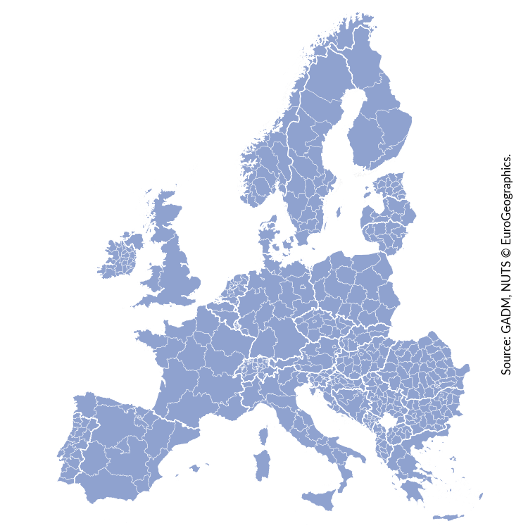
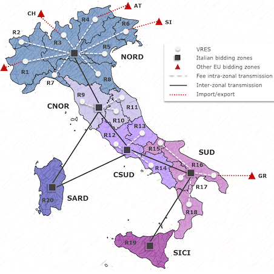

  

    
    

      <h3 class="card-title">Bangalore</h3>
      
Bangalore-Calliope models an illustrative district in Bangalore, India. The model is focused on decision-making under uncertain demand and national grid availability, by using scenario optimisation.

      
<small class="text-muted"><a href="https://github.com/brynpickering/bangalore-calliope">Available on GitHub.</a></small>

    

  

  

    
    

      <h3 class="card-title">Cambridge</h3>
      
Cambridge-Calliope models a new development at the district level in Cambridge (UK). It focuses on optimising system design under uncertain demand.

      
<small class="text-muted"><a href="https://github.com/brynpickering/cambridge-calliope">Available on GitHub.</a></small>

    

  

  

    
    

      <h3 class="card-title">Europe</h3>
      
Euro-Calliope is a model of the European power system that can be built as a version resolved to individual countries or to 497 first-level administrative subdivisions, with hourly generation and demand data.

      
<small class="text-muted"><a href="https://github.com/timtroendle/euro-calliope">Available on GitHub.</a></small>

    

  

  

    
    

      <h3 class="card-title">South Africa</h3>
      
SA-Calliope was used in a <a href="https://doi.org/10.1016/j.energy.2015.04.077">peer-reviewed paper</a> comparing concentrating solar power (CSP) and nuclear as baseload providers in South Africa. It contains commercially licensed data and is thus not freely and publicly available.

      
<small class="text-muted"><a href="mailto:stefan.pfenninger@usys.ethz.ch">Email </a> for access and more information.</small>

    

  

  

    
    

      <h3 class="card-title">UK</h3>
      
UK-Calliope is a 20-zone model of the power system of Great Britain (England, Scotland, Wales), with 20 years of validated hourly wind and PV generation data, used in several peer-reviewed publications.

      
<small class="text-muted"><a href="https://github.com/sjpfenninger/uk-calliope">Available on GitHub.</a></small>

    

  

  

    
    

      <h3 class="card-title">China</h3>
      
China-Calliope is a province-level power system model of China with hourly generation and demand data (in development).

      
<small class="text-muted"><a href="mailto:stefan.pfenninger@usys.ethz.ch">Email </a> for access and more information.</small>

    

  

  

    
    

      <h3 class="card-title">Kenya</h3>
      
Calliope-Kenya is a five-region model of Kenya developed at Politecnico di Milano.

      
<small class="text-muted"><a href="https://github.com/SESAM-Polimi/Calliope-Kenya">Available on GitHub.</a></small>

    

  

    

    
    

      <h3 class="card-title">Italy</h3>
      
Calliope-Italy is a model of the Italian energy system adopting a double spatial scale: renewable and heat generation is modelled across 20 regions based on region-specific weather conditions and potentials, whilst dispatchable capacity and transmission bottlenecks are grouped by the 6 bidding zones of the Italian electricity market. 

      
<small class="text-muted"><a href="https://github.com/FLomb/Calliope-Italy">Available on GitHub.</a></small>

    

  

