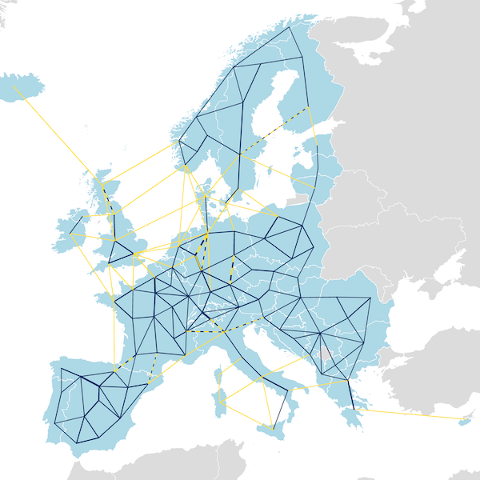
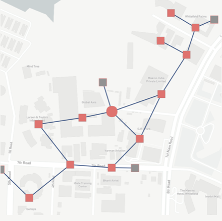
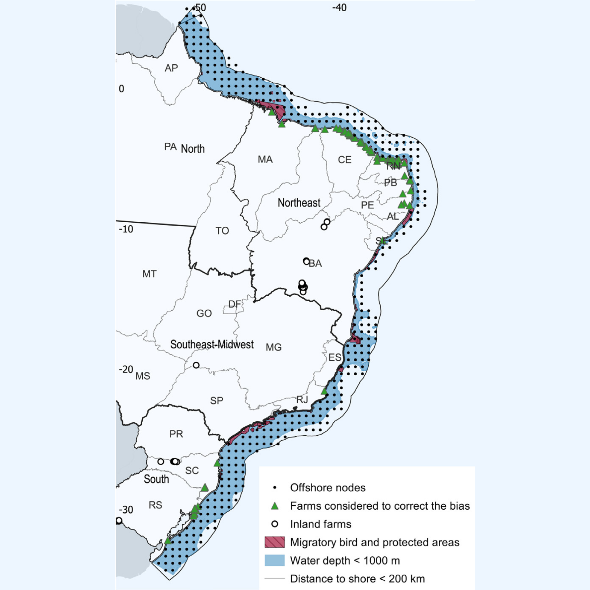

Calliope has been used in a variety of published studies on topics ranging from operational studies on small-scale urban districts to continent-wide decarbonisation scenarios. It is extensively tested and has withstood the test of peer review many times (see the [list of publications](#publications) below), so can serve as a solid foundation on top of which to rapidly develop a problem-specific model. Calliope is used not just in academic research, but also by [commercial partners](/partners-and-team).

{}
On this page:

* Some highlighted [example applications of Calliope](#example-applications-of-calliope) at different spatial scales and in different contexts.
* Details on [Euro-Calliope](#euro-calliope-models), a series flagship models built with Calliope.
* An overview of other [models built with Calliope](#models).
* A list of [publications](#publications) using Calliope-powered models.
{}

### Example applications of Calliope

  

    
    

      <h3 class="card-title">European energy system</h3>
      
We develop a range of European models: Euro-Calliope, a power-system-only model resolved to individual countries or to 497 first-level administrative subdivisions, and Sector-Coupled Euro-Calliope, resolved to 98 nodes and covering all end-use demands of energy as well as industrial feedstocks.

      
<small class="text-muted"><a href="#euro-calliope-models">See more details below.</a></small>

    

  

  

    
    

      <h3 class="card-title">Bangalore district-scale system</h3>
      
Bangalore-Calliope models an illustrative district in Bangalore, India. The model is focused on decision-making under uncsertain demand and national grid availability, by using scenario optimisation.

      
<small class="text-muted">Used in <a href="https://doi.org/10.1016/j.apenergy.2021.116465">Pickering and Choudhary (2021)</a> and other studies. Available on <a href="https://github.com/brynpickering/bangalore-calliope">GitHub</a>.</small>

    

  

  

    
    

      <h3 class="card-title">NREL Engage graphical modeling tool</h3>
      
Engage™ is a highly accessible and flexible web-based energy planning model for rapid multi-sectoral scenario exploration, built on top of Calliope.

      
Its cloud-based shared data model, intuitive interface and visualization capabilities facilitate collaboration and communication among diverse stakeholder groups, teams, and experts modeling systems from district energy / microgrid to national scales.

      
<small class="text-muted">See <a href="https://www.nrel.gov/state-local-tribal/engage-energy-modeling-tool.html">website</a> and <a href="https://github.com/NREL/engage">GitHub repo</a>.</small>

    

  

  

    
    

      <h3 class="card-title">Brazilian offshore wind</h3>
      
The Brazil-Offshore Wind Model is purpose-built to examine the potential role of offshore wind deployment in the Brazilian power system. It is a good example of a model which does not aim to capture a "complete" system, but only those parts necessary to answer the question at hand.

      
<small class="text-muted">Used in <a href="https://doi.org/10.1016/j.enconman.2022.116616">Borba et al. (2023)</a>. Available on <a href="https://zenodo.org/record/6767868">Zenodo.</a></small>

    

  

### Euro-Calliope models

Developed partly by the core developers of Calliope itself, the Euro-Calliope provides two things:

* A set of automated data processing code to generate models of the European electricity and energy system.
* Various fully-ready Calliope models built with this code, which we call "pre-built models" or "pre-builts".

Two versions of Euro-Calliope exist. First, a fully sector-coupled version which includes besides the electricity system also the transport, heat, and the industry sectors (including the use of non-energy feedstocks). Second, the power-sector only model on which the sector-coupled version builds, but which retains interesting features of its own - for example a more flexible spatial resolution.

#### Sector-coupled Euro-Calliope



The data processing code and its documentation is available at https://github.com/calliope-project/sector-coupled-euro-calliope.

Pre-built versions:

* The version used in the paper "[Diversity of Options to Eliminate Fossil Fuels and Reach Carbon Neutrality across the Entire European Energy System](https://doi.org/10.1016/j.joule.2022.05.009)", (Pickering, Lombardi, and Pfenninger 2022) [is on Zenodo](https://doi.org/10.5281/zenodo.6546817).

#### Euro-Calliope (power sector only)



The data processing code and its documentation is available at https://euro-calliope.readthedocs.io/.

Pre-builts are available at https://doi.org/10.5281/zenodo.3949553.

### Models

{}
These are some of the models built with Calliope by the core Calliope team and its partners, or models that we are aware of. [Add your model directly with a pull request](https://github.com/calliope-project/callio.pe/edit/master/content/pages/research.md) or [contact us](mailto:s.pfenninger@tudelft.nl) if you have a model that you would like to be listed here. Also see the [examples highlighted above](#example-applications-of-calliope)!
{}

* **Calliope-Italy**. A model of the Italian energy system adopting a double spatial scale: renewable and heat generation is modelled across 20 regions based on region-specific weather conditions and potentials, whilst dispatchable capacity and transmission bottlenecks are grouped by the 6 bidding zones of the Italian electricity market. [→ GitHub](https://github.com/FLomb/Calliope-Italy).
* **UK-Calliope**. A 20-zone model of the power system of Great Britain (England, Scotland, Wales), with 20 years of validated hourly wind and PV generation data, used in several peer-reviewed publications. [→ GitHub](https://github.com/calliope-project/uk-calliope).
* **SA-Calliope**. Used in a [peer-reviewed paper](https://doi.org/10.1016/j.energy.2015.04.077) comparing concentrating solar power (CSP) and nuclear as baseload providers in South Africa. It contains commercially licensed data and is thus not freely and publicly available. [Email for access and more information](mailto:s.pfenninger@tudelft.nl).
* **Cambridge-Calliope**. Models a new development at the district level in Cambridge (UK). It focuses on optimising system design under uncertain demand. [→ GitHub](https://github.com/brynpickering/cambridge-calliope)
* **Calliope-Kenya**. Calliope-Kenya is a five-region model of Kenya developed at Politecnico di Milano. [→ GitHub](https://github.com/SESAM-Polimi/Calliope-Kenya).

### Publications

{}
This section lists the publicly available work based on Calliope which we are aware of. [Add your publications directly with a pull request](https://github.com/calliope-project/callio.pe/edit/master/content/pages/research.md) or [contact us](mailto:s.pfenninger@tudelft.nl) if you have a publication that you would like to be listed here.
{}

Priyanka Laha and Basab Chakraborty (2021). Cost optimal combinations of storage technologies for maximizing renewable integration in Indian power system by 2040: Multi-region approach. *Renewable Energy*. [doi: 10.1016/j.renene.2021.07.027](https://doi.org/10.1016/j.renene.2021.07.027)

Bryn Pickering and Ruchi Choudhary (2021). Quantifying resilience in energy systems with out-of-sample testing. *Applied Energy*. [doi: 10.1016/j.apenergy.2021.116465](https://doi.org/10.1016/j.apenergy.2021.116465)

Guilherme Pontes Luz and Rodrigo Amaro e Silva (2021). Modeling Energy Communities with Collective Photovoltaic Self-Consumption: Synergies between a Small City and a Winery in Portugal. *Energies*. [doi: 10.3390/en14020323](https://doi.org/10.3390/en14020323)

Simon Morgenthaler, Christopher Ball, Jan Koj, Wilhelm Kuckshinrichs and Dirk Witthaut (2020). Site-dependent levelized cost assessment for fully renewable Power-to-Methane systems. *Energy Conversion and Management*. [doi: 10.1016/j.enconman.2020.113150](https://doi.org/10.1016/j.enconman.2020.113150)

Tim Tröndle, Johan Lilliestam, Stefano Marelli and Stefan Pfenninger (2020). Trade-offs between geographic scale, cost, and infrastructure requirements for fully renewable electricity in Europe. *Joule*. [doi: 10.1016/j.joule.2020.07.018](https://doi.org/10.1016/j.joule.2020.07.018)

Tim Tröndle (2020). Supply-side options to reduce land requirements of fully renewable electricity in Europe. *PLOS ONE*. [doi: 10.1371/journal.pone.0236958](https://doi.org/10.1371/journal.pone.0236958)

Francesco Lombardi, Bryn Pickering, Emanuela Colombo and Stefan Pfenninger (2020). Policy decision support for renewables deployment through spatially explicit practically optimal alternatives. *Joule*. [doi: 10.1016/j.joule.2020.08.002](https://doi.org/10.1016/j.joule.2020.08.002)

Francesco Lombardi, Sylvain Quoilin and Emanuela Colombo (2020). Modelling distributed Power-to-Heat technologies as a flexibility option for smart heat-electricity integration. *Proceedings of the 33rd ECOS Conference*, Osaka, Japan, July 2020. [PDF link](https://www.researchgate.net/publication/342961468_Modelling_distributed_Power-to-Heat_technologies_as_a_flexibility_option_for_smart_heat-electricity_integration)

Simon Morgenthaler, Wilhelm Kuckshinrichs and Dirk Witthaut (2020). Optimal system layout and locations for fully renewable high temperature co-electrolysis. *Applied Energy*. [doi: 10.1016/j.apenergy.2019.114218](https://doi.org/10.1016/j.apenergy.2019.114218)

C. Del Pero, F. Leonforte, F. Lombardi, N. Stevanato, J. Barbieri, N. Aste, H. Huerto, E. Colombo (2019). Modelling Of An Integrated Multi-Energy System For A Nearly Zero Energy Smart District. 2019 International Conference on Clean Electrical Power (ICCEP) (pp. 246–252). [doi: 10.1109/ICCEP.2019.8890129](https://doi.org/10.1109/ICCEP.2019.8890129)

Adriaan Hilbers, David Brayshaw and Axel Gandy (2019). Importance subsampling: improving power system planning under climate-based uncertainty. *Applied Energy*. [doi: 10.1016/j.apenergy.2019.04.110](https://doi.org/10.1016/j.apenergy.2019.04.110)

Francesco Lombardi, Matteo Vincenzo Rocco and Emanuela Colombo (2019). A multi-layer energy modelling methodology to assess the impact of heat-electricity integration strategies: the case of the residential cooking sector in Italy. *Energy*. [doi: 10.1016/j.energy.2019.01.004](https://doi.org/10.1016/j.energy.2019.01.004)

Bryn Pickering and Ruchi Choudhary (2019). District energy system optimisation under uncertain demand: Handling data-driven stochastic profiles. *Applied Energy*. [doi: 10.1016/j.apenergy.2018.12.037](https://doi.org/10.1016/j.apenergy.2018.12.037)

Bryn Pickering and Ruchi Choudhary (2018). Mitigating risk in district-level energy investment decisions by scenario optimisation, in: *Proceedings of BSO 2018*. Presented at the 4th Building Simulation and Optimization Conference, Cambridge, UK, pp. 38–45. [PDF in Conference proceedings](http://www.ibpsa.org/proceedings/BSO2018/1B-1.pdf)

Bryn Pickering and Ruchi Choudhary (2017). Applying Piecewise Linear Characteristic Curves in District Energy Optimisation. *Proceedings of the 30th ECOS Conference*, San Diego, CA, 2-6 July 2017. [PDF link](https://www.researchgate.net/publication/319334427_Applying_Piecewise_Linear_Characteristic_Curves_in_District_Energy_Optimisation)

Stefan Pfenninger (2017). Dealing with multiple decades of hourly wind and PV time series in energy models: a comparison of methods to reduce time resolution and the planning implications of inter-annual variability. *Applied Energy*. [doi: 10.1016/j.apenergy.2017.03.051](https://doi.org/10.1016/j.apenergy.2017.03.051)

Paula Díaz Redondo, Oscar Van Vliet and Anthony Patt (2017). Do We Need Gas as a Bridging Fuel? A Case Study of the Electricity System of Switzerland. *Energies*, 10 (7), p. 861. [doi: 10.3390/en10070861](https://doi.org/10.3390/en10070861)

Paula Díaz Redondo and Oscar Van Vliet (2016). Modelling the Energy Future of Switzerland after the Phase Out of Nuclear Power Plants. *Energy Procedia*. [doi: 10.1016/j.egypro.2015.07.843](https://doi.org/10.1016/j.egypro.2015.07.843)

Mercè Labordena and Johan Lilliestam (2015). Cost and Transmission Requirements for Reliable Solar Electricity from Deserts in China and the United States. *Energy Procedia*. [doi: 10.1016/j.egypro.2015.07.850](https://doi.org/10.1016/j.egypro.2015.07.850)

Stefan Pfenninger and James Keirstead (2015). Renewables, nuclear, or fossil fuels? Comparing scenarios for the Great Britain electricity system. *Applied Energy*, 152, pp. 83-93. [doi: 10.1016/j.apenergy.2015.04.102](https://doi.org/10.1016/j.apenergy.2015.04.102)

Stefan Pfenninger and James Keirstead (2015). Comparing concentrating solar and nuclear power as baseload providers using the example of South Africa. *Energy*. [doi: 10.1016/j.energy.2015.04.077](https://doi.org/10.1016/j.energy.2015.04.077)
